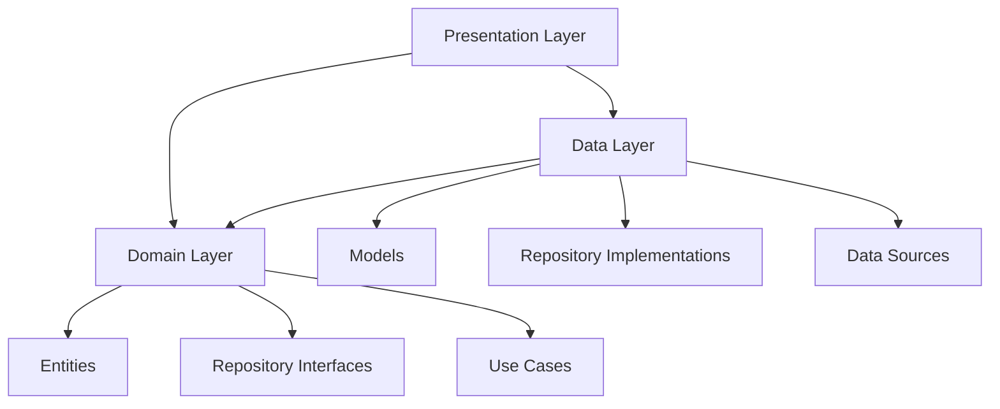

# Design Document: Clean Architecture Refactor

## Overview

This design document outlines the refactoring of the Engliya Flutter application from a phase-specific implementation to a proper Clean Architecture structure. The current codebase has significant duplication with 5 separate final test services, 5+ unit providers, 20+ phase-specific screens, and numerous duplicate models. This refactoring will consolidate these into generic, configurable components.

### Current State Analysis

**Services (5 duplicates):**
- phase1_final_test_service.dart
- phase2_final_test_service.dart
- phase3_final_test_service.dart
- phase4_final_test_service.dart
- phase5_final_test_service.dart

**Providers (10+ duplicates):**
- phase2_unit_provider.dart, phase3_unit_provider.dart, phase4_unit_provider.dart
- phase2_final_test_provider.dart, phase3_final_test_provider.dart, etc.

**Screens (20+ duplicates):**
- phase1_unit_screen.dart through phase4_unit_screen.dart
- phase1_final_test_screen.dart through phase5_final_test_screen.dart
- phase1_final_test_result_screen.dart through phase5_final_test_result_screen.dart
- phase1_final_test_review_screen.dart through phase5_final_test_review_screen.dart

**Models (15+ duplicates):**
- phase2_unit.dart, phase3_unit.dart, phase4_unit.dart
- phase2_final_test_question.dart through phase5_final_test_question.dart
- phase2_test_result.dart through phase5_test_result.dart

## Architecture

The refactored architecture follows Clean Architecture principles with three main layers:

```
lib/
├── core/                          # Shared utilities, constants, widgets
│   ├── constants/
│   ├── utils/
│   └── widgets/
├── features/
│   └── learn/
│       ├── domain/                # Business logic layer
│       │   ├── entities/          # Core business objects
│       │   ├── repositories/      # Repository interfaces
│       │   └── use_cases/         # Business operations
│       ├── data/                  # Data layer
│       │   ├── models/            # Data transfer objects
│       │   ├── datasources/       # Data sources (local, remote)
│       │   └── repositories/      # Repository implementations
│       └── presentation/          # UI layer
│           ├── providers/         # State management
│           ├── screens/           # Screen widgets
│           │   ├── unit/          # Unit-related screens
│           │   ├── lesson/        # Lesson-related screens
│           │   └── test/          # Test-related screens
│           └── widgets/           # Reusable UI components
└── services/                      # External services (AI, storage)
```

### Dependency Flow



## Components and Interfaces

### Phase Configuration System

```dart
/// Centralized configuration for all phases
enum PhaseType { phase1, phase2, phase3, phase4, phase5 }

class PhaseConfig {
  final PhaseType type;
  final String id;
  final String name;
  final String assetPath;
  final int passingScore;
  final int totalQuestions;
  final Map<String, int> questionDistribution;
  final Map<String, String> unitNames;
  final Map<String, String> lessonToUnitMapping;
  final String storageKeyPrefix;
  
  const PhaseConfig({
    required this.type,
    required this.id,
    required this.name,
    required this.assetPath,
    required this.passingScore,
    required this.totalQuestions,
    required this.questionDistribution,
    required this.unitNames,
    required this.lessonToUnitMapping,
    required this.storageKeyPrefix,
  });
  
  // Storage keys derived from prefix
  String get keyTestPassed => '${storageKeyPrefix}_final_test_passed';
  String get keyTestScore => '${storageKeyPrefix}_final_test_score';
  String get keyTestDate => '${storageKeyPrefix}_final_test_date';
  String get keyTestResult => '${storageKeyPrefix}_final_test_result';
  String get keyNextPhaseUnlocked => '${storageKeyPrefix}_next_phase_unlocked';
  
  // Static configurations for all phases
  static const phase1 = PhaseConfig(...);
  static const phase2 = PhaseConfig(...);
  // etc.
  
  static PhaseConfig fromType(PhaseType type) => switch (type) {
    PhaseType.phase1 => phase1,
    PhaseType.phase2 => phase2,
    // etc.
  };
}
```

### Domain Layer

#### Entities

```dart
// domain/entities/test_question.dart
class TestQuestion {
  final String id;
  final String lessonId;
  final String lessonTitle;
  final String? unitId;
  final String promptEn;
  final String? promptTa;
  final List<String> options;
  final int correctIndex;
  final String questionType;
  
  const TestQuestion({...});
}

// domain/entities/test_result.dart
class TestResult {
  final int totalQuestions;
  final int correctAnswers;
  final int incorrectAnswers;
  final double accuracy;
  final bool passed;
  final DateTime completedAt;
  final Map<String, UnitPerformance>? unitBreakdown;
  final List<IncorrectAnswer> incorrectQuestionDetails;
  
  const TestResult({...});
}

// domain/entities/unit.dart
class Unit {
  final String id;
  final int order;
  final String title;
  final String description;
  final int lessonCount;
  final int masteredCount;
  
  double get progressPercentage => lessonCount > 0 ? masteredCount / lessonCount : 0.0;
  bool get isCompleted => masteredCount == lessonCount;
}
```

#### Repository Interfaces

```dart
// domain/repositories/test_repository.dart
abstract class TestRepository {
  Future<List<TestQuestion>> generateTest(PhaseConfig config);
  Future<void> saveTestResult(PhaseConfig config, TestResult result);
  Future<TestResult?> loadTestResult(PhaseConfig config);
  Future<bool> hasPassedTest(PhaseConfig config);
  Future<int?> getLastTestScore(PhaseConfig config);
  Future<void> clearTestData(PhaseConfig config);
}

// domain/repositories/progress_repository.dart
abstract class ProgressRepository {
  Future<Map<String, UserLessonStatus>> loadAllProgress();
  Future<bool> arePhaseLessonsMastered(PhaseConfig config);
  Future<void> saveProgress(String lessonId, UserLessonStatus status);
}
```

#### Use Cases

```dart
// domain/use_cases/generate_test.dart
class GenerateTestUseCase {
  final TestRepository _repository;
  
  GenerateTestUseCase(this._repository);
  
  Future<List<TestQuestion>> call(PhaseConfig config) {
    return _repository.generateTest(config);
  }
}

// domain/use_cases/submit_test.dart
class SubmitTestUseCase {
  final TestRepository _repository;
  
  SubmitTestUseCase(this._repository);
  
  Future<TestResult> call({
    required PhaseConfig config,
    required List<TestQuestion> questions,
    required List<int?> answers,
  }) async {
    final result = _calculateResult(config, questions, answers);
    await _repository.saveTestResult(config, result);
    return result;
  }
}
```

### Data Layer

#### Models (DTOs)

```dart
// data/models/test_question_model.dart
class TestQuestionModel extends TestQuestion {
  const TestQuestionModel({...});
  
  factory TestQuestionModel.fromJson(Map<String, dynamic> json, String lessonId, String lessonTitle, String? unitId) {...}
  
  factory TestQuestionModel.fromLessonQuestion(Map<String, dynamic> json, String lessonId, String lessonTitle, String? unitId) {...}
  
  Map<String, dynamic> toJson() {...}
  
  TestQuestion toEntity() => TestQuestion(...);
}

// data/models/test_result_model.dart
class TestResultModel extends TestResult {
  const TestResultModel({...});
  
  factory TestResultModel.fromJson(Map<String, dynamic> json) {...}
  
  Map<String, dynamic> toJson() {...}
  
  TestResult toEntity() => TestResult(...);
}

// data/models/unit_model.dart
class UnitModel extends Unit {
  const UnitModel({...});
  
  factory UnitModel.fromConfig(String unitId, PhaseConfig config, int masteredCount) {...}
  
  Unit toEntity() => Unit(...);
}
```

#### Repository Implementations

```dart
// data/repositories/test_repository_impl.dart
class TestRepositoryImpl implements TestRepository {
  final LessonRepository _lessonRepository;
  final StorageService _storageService;
  
  TestRepositoryImpl({
    required LessonRepository lessonRepository,
    required StorageService storageService,
  });
  
  @override
  Future<List<TestQuestion>> generateTest(PhaseConfig config) async {
    final questions = <TestQuestionModel>[];
    
    for (final entry in config.questionDistribution.entries) {
      final unitQuestions = await _loadUnitQuestions(config, entry.key, entry.value);
      questions.addAll(unitQuestions);
    }
    
    if (questions.length < config.totalQuestions * 0.8) {
      throw InsufficientQuestionsException(...);
    }
    
    questions.shuffle(Random());
    return questions.map((m) => m.toEntity()).toList();
  }
  
  @override
  Future<void> saveTestResult(PhaseConfig config, TestResult result) async {
    await _storageService.setBool(config.keyTestPassed, result.passed);
    await _storageService.setInt(config.keyTestScore, result.correctAnswers);
    await _storageService.setString(config.keyTestDate, result.completedAt.toIso8601String());
    await _storageService.setJson(config.keyTestResult, TestResultModel.fromEntity(result).toJson());
    
    if (result.passed) {
      await _storageService.setBool(config.keyNextPhaseUnlocked, true);
    }
  }
  
  // ... other implementations
}
```

### Presentation Layer

#### Unified Providers

```dart
// presentation/providers/test_provider.dart
@riverpod
class FinalTestNotifier extends _$FinalTestNotifier {
  @override
  FinalTestState build(PhaseType phaseType) {
    return FinalTestState.initial();
  }
  
  Future<void> generateTest() async {
    state = state.copyWith(status: TestStatus.loading);
    
    final config = PhaseConfig.fromType(phaseType);
    final generateTest = ref.read(generateTestUseCaseProvider);
    
    try {
      final questions = await generateTest(config);
      state = state.copyWith(
        status: TestStatus.ready,
        questions: questions,
      );
    } catch (e) {
      state = state.copyWith(
        status: TestStatus.error,
        errorMessage: e.toString(),
      );
    }
  }
  
  void selectAnswer(int questionIndex, int answerIndex) {...}
  
  Future<TestResult> submitTest() async {...}
}

// presentation/providers/unit_provider.dart
@riverpod
class UnitNotifier extends _$UnitNotifier {
  @override
  UnitState build(PhaseType phaseType) {
    return UnitState.initial();
  }
  
  Future<void> loadUnits() async {...}
}
```

#### Unified Screens

```dart
// presentation/screens/test/final_test_screen.dart
class FinalTestScreen extends ConsumerWidget {
  final PhaseType phaseType;
  
  const FinalTestScreen({required this.phaseType, super.key});
  
  @override
  Widget build(BuildContext context, WidgetRef ref) {
    final state = ref.watch(finalTestNotifierProvider(phaseType));
    final config = PhaseConfig.fromType(phaseType);
    
    return Scaffold(
      appBar: AppBar(title: Text('${config.name} Final Test')),
      body: switch (state.status) {
        TestStatus.loading => const LoadingIndicator(),
        TestStatus.ready => _buildTestContent(context, ref, state),
        TestStatus.error => ErrorDisplay(message: state.errorMessage),
        TestStatus.completed => _buildCompletedView(context, state),
      },
    );
  }
}

// presentation/screens/test/test_result_screen.dart
class TestResultScreen extends ConsumerWidget {
  final PhaseType phaseType;
  final TestResult result;
  
  const TestResultScreen({
    required this.phaseType,
    required this.result,
    super.key,
  });
  
  @override
  Widget build(BuildContext context, WidgetRef ref) {
    final config = PhaseConfig.fromType(phaseType);
    
    return Scaffold(
      appBar: AppBar(title: Text('${config.name} Test Results')),
      body: Column(
        children: [
          ScoreCard(
            score: result.correctAnswers,
            total: result.totalQuestions,
            passed: result.passed,
            passingScore: config.passingScore,
          ),
          if (result.unitBreakdown != null)
            UnitBreakdownCard(breakdown: result.unitBreakdown!),
          // ...
        ],
      ),
    );
  }
}

// presentation/screens/unit/unit_screen.dart
class UnitScreen extends ConsumerWidget {
  final PhaseType phaseType;
  
  const UnitScreen({required this.phaseType, super.key});
  
  @override
  Widget build(BuildContext context, WidgetRef ref) {
    final state = ref.watch(unitNotifierProvider(phaseType));
    final config = PhaseConfig.fromType(phaseType);
    
    return Scaffold(
      appBar: AppBar(title: Text(config.name)),
      body: ListView.builder(
        itemCount: state.units.length,
        itemBuilder: (context, index) => UnitCard(
          unit: state.units[index],
          onTap: () => _navigateToLessons(context, state.units[index]),
        ),
      ),
    );
  }
}
```

## Data Models

### Unified TestQuestion Model

| Field | Type | Description |
|-------|------|-------------|
| id | String | Unique identifier |
| lessonId | String | Source lesson ID |
| lessonTitle | String | Source lesson title |
| unitId | String? | Unit ID (for phases with units) |
| promptEn | String | Question text in English |
| promptTa | String? | Question text in Tamil (optional) |
| options | List<String> | Answer options |
| correctIndex | int | Index of correct answer |
| questionType | String | Type of question (mcq, fill-blank, etc.) |

### Unified TestResult Model

| Field | Type | Description |
|-------|------|-------------|
| totalQuestions | int | Total questions in test |
| correctAnswers | int | Number of correct answers |
| incorrectAnswers | int | Number of incorrect answers |
| accuracy | double | Percentage accuracy |
| passed | bool | Whether test was passed |
| completedAt | DateTime | Completion timestamp |
| unitBreakdown | Map<String, UnitPerformance>? | Per-unit performance (optional) |
| incorrectQuestionDetails | List<IncorrectAnswer> | Details of wrong answers |

### Unified Unit Model

| Field | Type | Description |
|-------|------|-------------|
| id | String | Unit identifier |
| order | int | Display order |
| title | String | Unit title |
| description | String | Unit description |
| lessonCount | int | Total lessons in unit |
| masteredCount | int | Mastered lessons count |


## Correctness Properties

*A property is a characteristic or behavior that should hold true across all valid executions of a system-essentially, a formal statement about what the system should do. Properties serve as the bridge between human-readable specifications and machine-verifiable correctness guarantees.*

### Property 1: Model Serialization Round-Trip

*For any* valid TestQuestion, TestResult, or Unit model instance, serializing to JSON via `toJson()` and then deserializing via `fromJson()` should produce an object that is equivalent to the original.

**Validates: Requirements 3.4, 3.5**

### Property 2: Phase Configuration Validity

*For any* PhaseType value, the corresponding PhaseConfig should contain:
- A non-empty id and name
- A valid asset path following the pattern `assets/lessons/phase{n}/`
- A positive passingScore that is less than or equal to totalQuestions
- A non-empty questionDistribution map where values sum to totalQuestions
- Valid storage key prefixes that are unique per phase

**Validates: Requirements 8.1, 8.2, 8.3**

### Property 3: Test Result Calculation Correctness

*For any* PhaseConfig, list of TestQuestions, and list of selected answers:
- The calculated correctAnswers + incorrectAnswers should equal totalQuestions
- The accuracy should equal (correctAnswers / totalQuestions) * 100
- The passed status should be true if and only if correctAnswers >= config.passingScore
- The incorrectQuestionDetails list should have exactly incorrectAnswers items

**Validates: Requirements 2.3**

### Property 4: Question Loading Phase Consistency

*For any* PhaseConfig, when generating a test, all returned TestQuestion objects should have lessonIds that match the phase's lessonToUnitMapping keys (i.e., questions come from the correct phase's lessons).

**Validates: Requirements 2.2**

## Error Handling

### Exception Hierarchy

```dart
// Base exception for learn feature
abstract class LearnException implements Exception {
  final String message;
  final String? code;
  final dynamic originalError;
  
  const LearnException(this.message, {this.code, this.originalError});
}

// Test-related exceptions
class TestGenerationException extends LearnException {
  const TestGenerationException(super.message, {super.code, super.originalError});
}

class InsufficientQuestionsException extends LearnException {
  final int available;
  final int required;
  
  const InsufficientQuestionsException(
    super.message, {
    required this.available,
    required this.required,
    super.code,
  });
}

class TestStorageException extends LearnException {
  const TestStorageException(super.message, {super.code, super.originalError});
}

// Data-related exceptions
class LessonLoadException extends LearnException {
  final String lessonId;
  
  const LessonLoadException(
    super.message, {
    required this.lessonId,
    super.code,
    super.originalError,
  });
}

class InvalidPhaseException extends LearnException {
  final String phaseId;
  
  const InvalidPhaseException(
    super.message, {
    required this.phaseId,
  });
}
```

### Error Handling Strategy

1. **Repository Layer**: Catch low-level errors, wrap in domain exceptions
2. **Use Case Layer**: Handle business logic errors, provide meaningful messages
3. **Provider Layer**: Convert exceptions to UI-friendly error states
4. **UI Layer**: Display appropriate error messages with retry options

### Graceful Degradation

- If some lessons fail to load, continue with available questions (minimum 80% threshold)
- If non-critical storage operations fail, log warning and continue
- If test result cannot be fully saved, save critical data (passed status, score) first

## Testing Strategy

### Property-Based Testing Library

The project will use **glados** (https://pub.dev/packages/glados) for property-based testing in Dart/Flutter. Glados provides:
- Automatic shrinking of failing cases
- Built-in generators for common types
- Custom generator support
- Integration with Flutter test framework

### Test Configuration

Each property-based test should run a minimum of **100 iterations** to ensure adequate coverage of the input space.

### Test Organization

```
test/
├── unit/
│   ├── domain/
│   │   └── entities/
│   │       ├── test_question_test.dart
│   │       ├── test_result_test.dart
│   │       └── unit_test.dart
│   ├── data/
│   │   ├── models/
│   │   │   └── model_serialization_test.dart
│   │   └── repositories/
│   │       └── test_repository_impl_test.dart
│   └── presentation/
│       └── providers/
│           └── test_provider_test.dart
├── property/
│   ├── model_roundtrip_property_test.dart
│   ├── phase_config_property_test.dart
│   ├── test_result_calculation_property_test.dart
│   └── question_loading_property_test.dart
└── integration/
    └── test_flow_integration_test.dart
```

### Property Test Annotations

Each property-based test must be annotated with the correctness property it validates:

```dart
// **Feature: clean-architecture-refactor, Property 1: Model Serialization Round-Trip**
// **Validates: Requirements 3.4, 3.5**
void main() {
  Glados<TestQuestionModel>().test('TestQuestion round-trip serialization', (question) {
    final json = question.toJson();
    final restored = TestQuestionModel.fromJson(json);
    expect(restored, equals(question));
  });
}
```

### Unit Tests

Unit tests will cover:
- Entity creation and validation
- Repository method behavior with mocked dependencies
- Provider state transitions
- Edge cases (empty lists, null values, boundary conditions)

### Integration Tests

Integration tests will verify:
- Complete test flow from generation to result saving
- Phase transitions and unlocking
- Data persistence across app restarts
