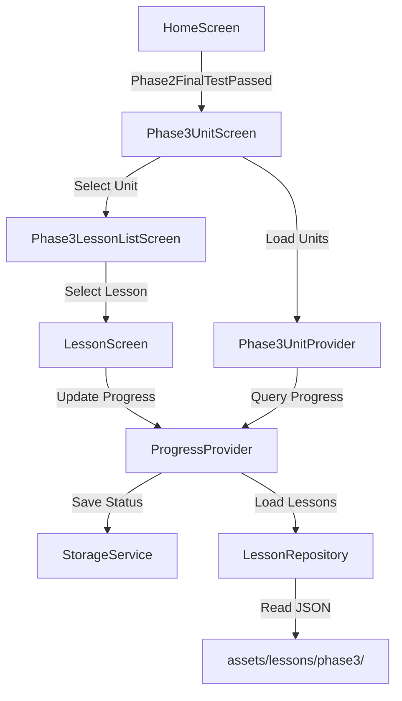

# Design Document

## Overview

Phase 3 – Real-Life Communication extends the English learning app to B1 proficiency level, building upon the grammar foundations established in Phase 1 and 2. This phase introduces 6 units (Units 12-17) containing 27 lessons focused on practical communication skills including story comprehension, complex sentence construction, passive voice, reported speech, functional English, and extended speaking/writing projects.

The implementation follows the established architectural patterns from Phase 1 and 2, reusing existing components (LessonScreen, UserLessonStatus, LessonRepository) while extending them to support Phase 3-specific content types. The design prioritizes consistency with existing user experience while introducing advanced learning activities that prepare learners for real-world English communication.

## Architecture

### High-Level Architecture

Phase 3 follows the existing three-layer architecture:

```
Presentation Layer (UI)
├── Phase3UnitScreen (displays 6 units)
├── Phase3LessonListScreen (displays lessons per unit)
└── LessonScreen (reused, displays lesson content)

Business Logic Layer (Providers)
├── Phase3UnitProvider (manages unit state)
├── ProgressProvider (reused, tracks lesson progress)
└── Phase3FinalTestProvider (placeholder for future)

Data Layer (Repositories & Models)
├── LessonRepository (extended for Phase 3)
├── ProgressRepository (reused)
├── Lesson model (reused)
└── UserLessonStatus model (reused)
```

### Component Relationships



### Data Flow

1. **Initialization**: User completes Phase 2 Final Test → `phase2FinalTestPassed` flag set to true
2. **Phase 3 Unlock**: HomeScreen checks flag → displays Phase 3 as unlocked
3. **Unit Display**: Phase3UnitScreen loads → Phase3UnitProvider calculates progress for each unit
4. **Lesson Access**: User taps unit → Phase3LessonListScreen loads lessons → checks unlock status
5. **Lesson Interaction**: User taps lesson → LessonScreen loads content → user completes activities
6. **Progress Tracking**: Scores saved → ProgressProvider updates → next lesson unlocks if mastery achieved

## Components and Interfaces

### 1. Phase3UnitScreen

**Purpose**: Display all 6 Phase 3 units with progress tracking

**State Management**:
```dart
class Phase3UnitScreen extends StatefulWidget {
  // Uses Phase3UnitProvider for state
  // Displays unit cards with mastery counts
  // Handles navigation to Phase3LessonListScreen
}
```

**UI Structure**:
- AppBar with title "Phase 3: Real-Life Communication"
- ListView of 6 UnitCard widgets
- Loading indicator during data fetch
- Error state with retry button

**Unit Definitions**:
```dart
final units = [
  Phase3Unit(
    id: 'phase3_unit12',
    order: 12,
    title: 'Story Listening & Retelling',
    description: 'Understand and retell stories',
    lessonCount: 4,
  ),
  Phase3Unit(
    id: 'phase3_unit13',
    order: 13,
    title: 'Complex Sentences & Connectors',
    description: 'Join ideas with connectors',
    lessonCount: 5,
  ),
  Phase3Unit(
    id: 'phase3_unit14',
    order: 14,
    title: 'Passive Voice',
    description: 'Use passive constructions',
    lessonCount: 4,
  ),
  Phase3Unit(
    id: 'phase3_unit15',
    order: 15,
    title: 'Reported Speech',
    description: 'Report what others said',
    lessonCount: 4,
  ),
  Phase3Unit(
    id: 'phase3_unit16',
    order: 16,
    title: 'Functional English',
    description: 'Handle everyday situations',
    lessonCount: 5,
  ),
  Phase3Unit(
    id: 'phase3_unit17',
    order: 17,
    title: 'Speaking & Writing Projects',
    description: 'Demonstrate communication skills',
    lessonCount: 5,
  ),
];
```

### 2. Phase3LessonListScreen

**Purpose**: Display all lessons within a selected Phase 3 unit

**State Management**:
```dart
class Phase3LessonListScreen extends StatefulWidget {
  final String unitId;
  
  // Uses ProgressProvider for lesson data
  // Displays lesson cards with lock status
  // Includes Phase 3 Final Test card at bottom
}
```

**UI Structure**:
- AppBar with unit title
- ListView of LessonCard widgets (reused component)
- Phase 3 Final Test card at bottom (locked until all lessons mastered)
- Loading/error states

**Lesson Unlock Logic**:
```dart
bool isLessonUnlocked(String lessonId) {
  // First lesson of Unit 12 unlocked if Phase 2 passed
  if (lessonId == 'phase3_lesson12_1') {
    return phase2FinalTestPassed;
  }
  
  // Other lessons unlock when previous lesson mastered
  final previousLesson = getPreviousLesson(lessonId);
  final previousStatus = getLessonStatus(previousLesson);
  return previousStatus?.masteryBestScore >= 80.0;
}
```

### 3. Phase3UnitProvider

**Purpose**: Manage Phase 3 unit screen state and progress calculation

**Interface**:
```dart
class Phase3UnitProvider extends ChangeNotifier {
  final ProgressProvider _progressProvider;
  
  List<Phase3Unit> _units = [];
  bool _isLoading = false;
  String? _error;
  
  // Getters
  List<Phase3Unit> get units;
  bool get isLoading;
  String? get error;
  
  // Methods
  Future<void> loadUnits();
  Future<void> reload();
  void clearError();
  
  // Private helper
  int _calculateUnitMasteredCount(String unitId);
}
```

**Implementation Pattern**: Mirrors Phase2UnitProvider exactly, with Phase 3 unit definitions

### 4. LessonRepository Extension

**Purpose**: Extend existing repository to load Phase 3 lessons

**New Methods**:
```dart
// Add to existing LessonRepository class
Future<List<Lesson>> _loadPhase3UnitLessons(String unitId) async {
  final lessons = <Lesson>[];
  final lessonIds = _getPhase3LessonIds(unitId);
  
  for (final lessonId in lessonIds) {
    final lesson = await loadLesson(lessonId);
    lessons.add(lesson);
  }
  
  lessons.sort((a, b) => a.order.compareTo(b.order));
  return lessons;
}

List<String> _getPhase3LessonIds(String unitId) {
  switch (unitId) {
    case 'phase3_unit12':
      return ['phase3_lesson12_1', 'phase3_lesson12_2', 
              'phase3_lesson12_3', 'phase3_lesson12_4'];
    case 'phase3_unit13':
      return ['phase3_lesson13_1', 'phase3_lesson13_2', 
              'phase3_lesson13_3', 'phase3_lesson13_4', 
              'phase3_lesson13_5'];
    // ... similar for units 14-17
  }
}

String _getPhase3AssetPath(String lessonId) {
  final lessonFileMap = {
    'phase3_lesson12_1': 'lesson12_1_story_listening.json',
    'phase3_lesson12_2': 'lesson12_2_story_qa.json',
    // ... all 27 lesson mappings
  };
  
  final fileName = lessonFileMap[lessonId];
  return 'assets/lessons/phase3/$fileName';
}
```

**Integration Point**: Modify `loadUnitLessons()` to handle `phase3_unit*` patterns

### 5. Phase3Unit Model

**Purpose**: Data model for Phase 3 units

**Structure**:
```dart
class Phase3Unit {
  final String id;
  final int order;
  final String title;
  final String description;
  final int lessonCount;
  int masteredCount;
  
  Phase3Unit({
    required this.id,
    required this.order,
    required this.title,
    required this.description,
    required this.lessonCount,
    this.masteredCount = 0,
  });
  
  double get progress => lessonCount > 0 
      ? masteredCount / lessonCount 
      : 0.0;
}
```

**Note**: This model is identical to Phase2Unit structure, could be unified as `Unit` model in future refactoring

## Data Models

### JSON Lesson Schema

Phase 3 lessons use the existing Lesson JSON schema with optional extensions:

**Base Schema** (all lessons):
```json
{
  "id": "phase3_lesson12_1",
  "order": 1,
  "unitId": "phase3_unit12",
  "title": "Short Story Listening",
  "description": "Listen to simple stories and answer questions",
  "level": "B1",
  "explain": {
    "titleTA": "கதை கேட்டல்",
    "titleEN": "Story Listening",
    "contentTA": "...",
    "contentEN": "...",
    "examples": [...],
    "table": null
  },
  "examples": [...],
  "listeningQuestions": [...],
  "speakSentences": [...],
  "practiceQuestions": [...],
  "masteryQuestions": [...]
}
```

**Phase 3 Extensions** (optional fields):

1. **Story Field** (Unit 12 lessons):
```json
{
  "story": [
    { "line": "A boy went to the river." },
    { "line": "He saw a golden fish." },
    { "line": "The fish could talk!" },
    { "line": "It asked the boy for help." }
  ]
}
```

2. **Sample Paragraph** (Unit 13, 17 lessons):
```json
{
  "sampleParagraph": "I wake up at 6 AM every day. First, I brush my teeth and take a shower. Then I have breakfast with my family. After breakfast, I go to work by bus. I work from 9 AM to 5 PM. In the evening, I come home and have dinner. Before bed, I read a book or watch TV."
}
```

3. **Interview Questions** (Unit 17 lessons):
```json
{
  "interviewQuestions": [
    "Tell me about yourself.",
    "Why do you want this job?",
    "What are your strengths?",
    "Where do you see yourself in 5 years?",
    "Do you have any questions for us?"
  ]
}
```

**Parsing Strategy**: 
- Existing `Lesson.fromJson()` ignores unknown fields
- Phase 3-specific fields can be accessed via raw JSON if needed
- LessonScreen tabs display standard fields only
- Future enhancement: Create Phase 3-specific lesson models if custom UI needed

### Lesson ID Naming Convention

**Pattern**: `phase3_lesson{unit}_{lesson}`

**Examples**:
- `phase3_lesson12_1` → Unit 12, Lesson 1
- `phase3_lesson13_5` → Unit 13, Lesson 5
- `phase3_lesson17_3` → Unit 17, Lesson 3

**File Naming**: `lesson{unit}_{lesson}_{topic}.json`

**Examples**:
- `lesson12_1_story_listening.json`
- `lesson13_2_because_so.json`
- `lesson17_5_mini_presentation.json`

### Progress Persistence

Phase 3 uses existing `UserLessonStatus` model without modifications:

```dart
{
  "lessonId": "phase3_lesson12_1",
  "explainDone": true,
  "examplesDone": true,
  "listeningScore": 100.0,
  "speakingScore": 85.0,
  "quizBestScore": 90.0,
  "masteryBestScore": 83.3,
  "isMastered": true,
  "lastAccessed": "2025-11-26T10:30:00.000Z"
}
```

**Mastery Calculation**: Same as Phase 1 & 2
- Mastery score = (masteryQuestions correct / total) * 100
- `isMastered = true` when `masteryBestScore >= 80.0`

## Error Handling

### Error Scenarios

1. **Phase 3 Locked**
   - Condition: `phase2FinalTestPassed == false`
   - Handling: Display dialog "Complete Phase 2 Final Test to unlock Phase 3"
   - UI: Locked icon on Phase 3 card in HomeScreen

2. **Lesson Load Failure**
   - Condition: JSON file missing or malformed
   - Handling: Log error, show error state with retry button
   - Fallback: Continue loading other lessons in unit

3. **Lesson Locked**
   - Condition: Previous lesson not mastered
   - Handling: Show snackbar "Please master the previous lesson first"
   - UI: Locked badge on lesson card

4. **Progress Save Failure**
   - Condition: StorageService write error
   - Handling: Log error, retry save operation
   - User Impact: Progress may not persist across sessions

### Error Recovery

```dart
// Graceful degradation for missing lessons
Future<List<Lesson>> loadUnitLessons(String unitId) async {
  final lessons = <Lesson>[];
  final lessonIds = _getPhase3LessonIds(unitId);
  
  for (final lessonId in lessonIds) {
    try {
      final lesson = await loadLesson(lessonId);
      lessons.add(lesson);
    } catch (e) {
      ErrorHandler.logError('Failed to load $lessonId', e);
      // Continue loading other lessons
    }
  }
  
  return lessons;
}
```

## Testing Strategy

### Unit Tests

1. **Phase3UnitProvider Tests**
   - Test unit initialization with correct data
   - Test mastery count calculation
   - Test reload functionality
   - Test error state handling

2. **LessonRepository Extension Tests**
   - Test Phase 3 lesson ID mapping
   - Test Phase 3 asset path generation
   - Test loading all 27 Phase 3 lessons
   - Test error handling for missing files

3. **Unlock Logic Tests**
   - Test first lesson unlocks when Phase 2 passed
   - Test sequential lesson unlocking
   - Test mastery threshold (80%) enforcement
   - Test cross-unit unlocking (Unit 12 → 13)

### Integration Tests

1. **Navigation Flow**
   - Test HomeScreen → Phase3UnitScreen navigation
   - Test Phase3UnitScreen → Phase3LessonListScreen navigation
   - Test Phase3LessonListScreen → LessonScreen navigation
   - Test back navigation preserves state

2. **Progress Persistence**
   - Test lesson completion saves to storage
   - Test mastery unlocks next lesson
   - Test progress survives app restart
   - Test progress displays correctly in unit screen

3. **Phase 2 → Phase 3 Transition**
   - Test Phase 3 locked before Phase 2 completion
   - Test Phase 3 unlocks after Phase 2 Final Test passed
   - Test first Phase 3 lesson accessible immediately

### Widget Tests

1. **Phase3UnitScreen Widget**
   - Test displays 6 unit cards
   - Test loading state renders correctly
   - Test error state with retry button
   - Test unit card tap navigation

2. **Phase3LessonListScreen Widget**
   - Test displays correct lesson count per unit
   - Test locked/unlocked lesson badges
   - Test Phase 3 Final Test card at bottom
   - Test lesson tap behavior (locked vs unlocked)

## Implementation Phases

### Phase A: Core Structure (Foundation)

**Goal**: Set up Phase 3 infrastructure without content

**Tasks**:
1. Create `Phase3Unit` model class
2. Create `Phase3UnitProvider` class
3. Create `Phase3UnitScreen` widget
4. Create `Phase3LessonListScreen` widget
5. Add Phase 3 routes to `AppRoutes`
6. Add Phase 3 unlock logic to `HomeScreen`
7. Extend `LessonRepository` with Phase 3 methods

**Deliverable**: Phase 3 screens accessible but showing empty/placeholder data

### Phase B: Unit 12 & 13 Content (Story & Connectors)

**Goal**: Implement first two units with full content

**Tasks**:
1. Create 4 JSON files for Unit 12 (Story Listening)
2. Create 5 JSON files for Unit 13 (Connectors)
3. Test lesson loading for Units 12 & 13
4. Verify unlock logic works across lessons
5. Test progress tracking for these units

**Deliverable**: Units 12 & 13 fully functional with realistic content

### Phase C: Units 14-17 Content (Advanced Grammar & Projects)

**Goal**: Complete remaining units

**Tasks**:
1. Create 4 JSON files for Unit 14 (Passive Voice)
2. Create 4 JSON files for Unit 15 (Reported Speech)
3. Create 5 JSON files for Unit 16 (Functional English)
4. Create 5 JSON files for Unit 17 (Projects)
5. Test all 27 lessons load correctly
6. Verify sequential unlocking across all units

**Deliverable**: All 27 Phase 3 lessons accessible and functional

### Phase D: Final Test Placeholder

**Goal**: Add Phase 3 Final Test entry point

**Tasks**:
1. Create `Phase3FinalTestScreen` placeholder
2. Add route `/phase3/finalTest`
3. Add Final Test card to Phase3LessonListScreen
4. Implement lock logic (all 27 lessons mastered)
5. Display "Coming Soon" message

**Deliverable**: Final Test accessible but not implemented

## Routing Configuration

### New Routes

```dart
// Add to AppRoutes class
static const String phase3Unit = '/phase3';
static const String phase3LessonList = '/phase3/unit/:unitId';
static const String phase3FinalTest = '/phase3/finalTest';

// Route handler additions
case phase3Unit:
  return _buildRoute(
    const Phase3UnitScreen(),
    settings,
  );

case phase3LessonList:
  final args = settings.arguments as Map<String, dynamic>?;
  if (args == null || args['unitId'] == null) {
    return _buildErrorRoute('Unit ID not provided');
  }
  return _buildRoute(
    Phase3LessonListScreen(unitId: args['unitId'] as String),
    settings,
  );

case phase3FinalTest:
  return _buildRoute(
    const Phase3FinalTestPlaceholderScreen(),
    settings,
  );
```

### Navigation Patterns

```dart
// From HomeScreen to Phase3UnitScreen
Navigator.pushNamed(context, AppRoutes.phase3Unit);

// From Phase3UnitScreen to Phase3LessonListScreen
Navigator.pushNamed(
  context,
  AppRoutes.phase3LessonList,
  arguments: {
    'unitId': 'phase3_unit12',
    'unitTitle': 'Story Listening & Retelling',
  },
);

// From Phase3LessonListScreen to LessonScreen
Navigator.pushNamed(
  context,
  AppRoutes.lesson,
  arguments: 'phase3_lesson12_1',
);
```

## UI/UX Considerations

### Visual Consistency

- Reuse existing `UnitCard` widget for Phase 3 units
- Reuse existing `LessonCard` widget for Phase 3 lessons
- Maintain color scheme and typography from Phase 1 & 2
- Use same loading/error state patterns

### Progress Indicators

- Unit cards show "X/Y mastered" format
- Lesson cards show status badges: Locked / In Progress / Mastered
- Phase 3 Final Test card shows lock status and requirements

### User Feedback

- Snackbar messages for locked content
- Dialog for Phase 3 unlock requirement
- Loading indicators during data fetch
- Error states with retry buttons

### Accessibility

- All interactive elements have semantic labels
- Color is not the only indicator of status (use icons + text)
- Sufficient contrast ratios for text
- Touch targets meet minimum size requirements (48x48dp)

## Performance Considerations

### Lesson Caching

- LessonRepository caches loaded lessons in memory
- Reduces repeated JSON parsing
- Cache cleared on app restart (acceptable for this use case)

### Lazy Loading

- Lessons loaded only when unit is opened
- Progress data loaded on-demand per screen
- JSON files loaded asynchronously

### Asset Size

- Each JSON lesson file: ~5-15 KB
- Total Phase 3 assets: ~270 KB (27 lessons × 10 KB average)
- Acceptable for mobile app bundle size

## Future Enhancements

### Phase 3-Specific UI

If Phase 3 content requires custom displays:

1. **Story Display Component**
   - Dedicated widget for rendering story lines
   - Audio playback controls
   - Highlighting current line during playback

2. **Paragraph Writing Interface**
   - Text input with word count
   - Grammar checking integration
   - Sample paragraph reference panel

3. **Interview Simulator**
   - Question-by-question flow
   - Recording and playback
   - Mock scoring feedback

### Content Extensions

1. **Story Audio Files**
   - Add MP3 files for story narration
   - Sync text highlighting with audio
   - Variable playback speed

2. **Writing Evaluation**
   - Basic grammar checking
   - Word count validation
   - Sentence structure analysis

3. **Speaking Assessment**
   - Improved STT accuracy
   - Fluency scoring
   - Pronunciation feedback

### Unified Unit Model

Refactor Phase2Unit and Phase3Unit into single `Unit` model:

```dart
class Unit {
  final String id;
  final int order;
  final String phase; // 'phase1', 'phase2', 'phase3'
  final String title;
  final String description;
  final int lessonCount;
  int masteredCount;
  
  // Factory constructors for each phase
  factory Unit.phase1(...);
  factory Unit.phase2(...);
  factory Unit.phase3(...);
}
```

This would simplify provider logic and reduce code duplication.
