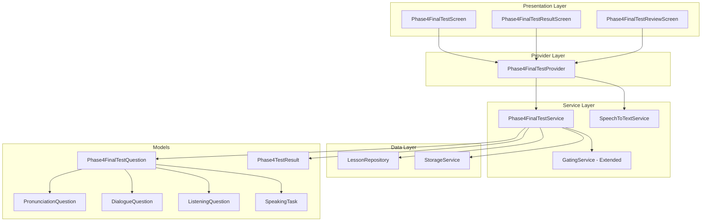

# Design Document: Phase 4 Final Test

## Overview

The Phase 4 Final Test is a hybrid assessment that evaluates learners' pronunciation awareness, fluency, listening comprehension, dialogue response skills, and functional conversation ability. It consists of 20 questions across 4 sections with a maximum score of 24 points, requiring 75% (18 points) to pass and unlock Phase 5.

### Key Design Goals
- Follow existing Phase 1-3 Final Test patterns for consistency
- Support hybrid question types: MCQs (16) and Speaking Tasks (4)
- Implement STT-based speaking scoring with mock fallback
- Enable mistake review for MCQ questions only
- Integrate with existing GatingService and StorageService

## Architecture



## Components and Interfaces

### 1. Phase4FinalTestQuestion (Union Type)

Base class representing any question type in the Phase 4 Final Test.

```dart
enum Phase4QuestionType {
  pronunciation,
  dialogue,
  listening,
  speaking,
}

class Phase4FinalTestQuestion {
  final String id;
  final Phase4QuestionType type;
  final String unitId;
  final String lessonId;
  final String prompt;
  final List<String>? options;      // null for speaking tasks
  final int? correctIndex;          // null for speaking tasks
  final String? audioText;          // for listening questions
  
  // Factory constructors for each type
  factory Phase4FinalTestQuestion.pronunciation(...);
  factory Phase4FinalTestQuestion.dialogue(...);
  factory Phase4FinalTestQuestion.listening(...);
  factory Phase4FinalTestQuestion.speaking(...);
}
```

### 2. PronunciationQuestion

```dart
class PronunciationQuestion {
  final String prompt;        // "Which sentence sounds more natural?"
  final List<String> options; // 4 options with stress patterns
  final int correctIndex;
}
```

### 3. DialogueQuestion

```dart
class DialogueQuestion {
  final String prompt;        // "Waiter: Would you like anything else?"
  final List<String> options; // Response options
  final int correctIndex;
}
```

### 4. ListeningQuestion

```dart
class ListeningQuestion {
  final String prompt;
  final String? audioText;    // Dialogue text to display
  final String? audioId;      // Optional audio file reference
  final List<String> options;
  final int correctIndex;
}
```

### 5. SpeakingTask

```dart
class SpeakingTask {
  final String prompt;        // "Describe your last shopping experience"
}
```

### 6. Phase4TestResult

```dart
class Phase4TestResult {
  final int totalQuestions;           // Always 20
  final int maxScore;                 // Always 24
  final int mcqCorrect;               // Out of 16
  final int speakingScore;            // Out of 12 (4 tasks × 3 points)
  final int totalScore;               // mcqCorrect + speakingScore
  final double percentage;
  final bool passed;                  // totalScore >= 18
  final DateTime completedAt;
  final List<IncorrectAnswer> incorrectMcqAnswers;
  final List<SpeakingResult> speakingResults;
  
  factory Phase4TestResult.calculate(...);
}
```

### 7. SpeakingResult

```dart
class SpeakingResult {
  final String taskId;
  final String prompt;
  final String? recognizedText;
  final int wordCount;
  final int score;            // 0-3
  final String feedback;
}
```

### 8. Phase4FinalTestService

```dart
class Phase4FinalTestService {
  // Storage keys
  static const String _keyTestPassed = 'phase4_final_test_passed';
  static const String _keyTestScore = 'phase4_final_test_score';
  static const String _keyPhase5Unlocked = 'phase5_unlocked';
  
  // Question distribution
  static const int pronunciationCount = 6;
  static const int dialogueCount = 6;
  static const int listeningCount = 4;
  static const int speakingCount = 4;
  static const int passingScore = 18;
  static const int maxScore = 24;
  
  Future<List<Phase4FinalTestQuestion>> generateTest();
  Future<bool> canTakeTest();
  bool validateMcqAnswer(Phase4FinalTestQuestion question, int selectedIndex);
  int scoreSpeakingTask(String? recognizedText);
  Phase4TestResult calculateResult(...);
  Future<void> saveTestResult(Phase4TestResult result);
  Future<bool> hasPassedTest();
}
```

### 9. Phase4FinalTestProvider

```dart
class Phase4FinalTestProvider extends ChangeNotifier {
  List<Phase4FinalTestQuestion> _questions = [];
  List<dynamic> _answers = [];  // int? for MCQ, SpeakingResult for speaking
  int _currentQuestionIndex = 0;
  bool _isLoading = false;
  String? _error;
  Phase4TestResult? _testResult;
  
  // Getters
  Phase4FinalTestQuestion? get currentQuestion;
  double get progress;
  bool get canProceed;
  bool get isLastQuestion;
  
  // Actions
  Future<void> startTest();
  void selectMcqAnswer(int index);
  void recordSpeakingResult(SpeakingResult result);
  void nextQuestion();
  void skipQuestion();
  Future<void> submitTest();
}
```

## Data Models

### Test Composition

| Section | Type | Count | Points Each | Max Points |
|---------|------|-------|-------------|------------|
| A | Pronunciation MCQ | 6 | 1 | 6 |
| B | Dialogue Response MCQ | 6 | 1 | 6 |
| C | Listening MCQ | 4 | 1 | 4 |
| D | Speaking Task | 4 | 0-3 | 12 |
| **Total** | | **20** | | **24** |

### Speaking Scoring Tiers

| Word Count | Score | Feedback |
|------------|-------|----------|
| 20+ words | 3 | "Great fluency! Clear and natural speech." |
| 10-19 words | 2 | "Good effort! Try to expand your response." |
| 1-9 words | 1 | "Keep practicing! Try to speak more." |
| 0 words | 0 | "No speech detected. Please try again." |

### Unit-to-Question Mapping

| Unit | Lesson IDs | Question Types |
|------|------------|----------------|
| Unit 18 | phase4_lesson18_1 - 18_4 | Pronunciation MCQs |
| Unit 19 | phase4_lesson19_1 - 19_4 | Speaking Tasks |
| Unit 20 | phase4_lesson20_1 - 20_5 | Dialogue MCQs, Listening |
| Unit 21 | phase4_lesson21_1 - 21_4 | Dialogue MCQs |


## Correctness Properties

*A property is a characteristic or behavior that should hold true across all valid executions of a system-essentially, a formal statement about what the system should do. Properties serve as the bridge between human-readable specifications and machine-verifiable correctness guarantees.*

### Property 1: Test Access Gating
*For any* mastery state where all Phase 4 lessons (Units 18-21) are mastered, the canTakeTest() method SHALL return true. Conversely, for any incomplete mastery state, canTakeTest() SHALL return false (unless debug mode is enabled).
**Validates: Requirements 1.1, 1.2**

### Property 2: Debug Mode Bypass
*For any* mastery state and any debug mode setting, when debug mode is enabled, canTakeTest() SHALL return true regardless of lesson mastery status.
**Validates: Requirements 1.3**

### Property 3: Question Distribution Consistency
*For any* generated test, the question distribution SHALL be exactly: 6 pronunciation MCQs, 6 dialogue MCQs, 4 listening MCQs, and 4 speaking tasks, totaling 20 questions.
**Validates: Requirements 1.4, 2.1, 3.1, 4.1, 5.1, 10.2**

### Property 4: MCQ Scoring Consistency
*For any* MCQ question (pronunciation, dialogue, or listening) and any selected answer index, the score SHALL be 1 if selectedIndex equals correctIndex, and 0 otherwise.
**Validates: Requirements 2.3, 3.3, 4.3**

### Property 5: Speaking Score Tiers
*For any* speaking task result with word count W, the score SHALL be: 3 if W >= 20, 2 if 10 <= W < 20, 1 if 1 <= W < 10, 0 if W == 0.
**Validates: Requirements 5.5**

### Property 6: Pass/Fail Threshold
*For any* test result with total score S, the passed flag SHALL be true if and only if S >= 18.
**Validates: Requirements 6.2, 6.3**

### Property 7: Result Persistence Consistency
*For any* passing test result, after saveTestResult() is called, the storage SHALL contain phase4FinalTestPassed=true, phase5Unlocked=true, and the correct phase4FinalTestScore value.
**Validates: Requirements 8.1, 8.2, 8.3**

### Property 8: Phase 5 Unlock Consistency
*For any* storage state, isPhase5Unlocked() SHALL return true if and only if phase4FinalTestPassed is true in storage.
**Validates: Requirements 8.4**

### Property 9: Review Filtering
*For any* test result, the incorrectMcqAnswers list SHALL contain only MCQ questions where the selected answer was incorrect, and SHALL exclude all speaking tasks.
**Validates: Requirements 7.1, 7.3**

### Property 10: Question Model Validity
*For any* generated question, MCQ types (pronunciation, dialogue, listening) SHALL have non-null options and correctIndex, while speaking tasks SHALL have null options and correctIndex.
**Validates: Requirements 9.1, 9.2, 9.3, 9.4**

### Property 11: Total Score Calculation
*For any* set of answers, the total score SHALL equal the sum of MCQ correct answers (0 or 1 each) plus speaking scores (0-3 each), with maximum possible score of 24.
**Validates: Requirements 6.1**

### Property 12: Fallback Question Guarantee
*For any* lesson content state (including empty), generateTest() SHALL return exactly 20 questions by using fallback hardcoded questions when lesson content is insufficient.
**Validates: Requirements 10.3**

## Error Handling

### Test Generation Errors
- If lesson JSON files fail to load, use fallback hardcoded questions
- Log errors but continue test generation
- Ensure minimum 20 questions are always available

### STT Service Errors
- Catch STT initialization failures gracefully
- Fall back to mock scoring with randomized variance (±1)
- Display user-friendly message about fallback mode

### Storage Errors
- Retry storage operations on failure
- Show warning snackbar if results cannot be saved
- Allow user to retry saving results

### Navigation Errors
- Validate route arguments before navigation
- Display error screen for missing/invalid arguments
- Provide back navigation from error states

## Testing Strategy

### Property-Based Testing Library
Use `fast_check` package for Dart property-based testing.

### Unit Tests
- Test Phase4FinalTestService question generation
- Test scoring logic for all question types
- Test result calculation and persistence
- Test GatingService Phase 4 test unlock logic

### Property-Based Tests
Each correctness property will be implemented as a property-based test:

1. **Property 1 Test**: Generate random mastery states, verify canTakeTest() returns correct value
2. **Property 3 Test**: Generate multiple tests, verify question distribution is always correct
3. **Property 4 Test**: Generate random MCQ answers, verify scoring is consistent
4. **Property 5 Test**: Generate random word counts, verify speaking scores match tiers
5. **Property 6 Test**: Generate random total scores, verify pass/fail threshold
6. **Property 9 Test**: Generate random test results, verify review filtering excludes speaking tasks

### Integration Tests
- Test full test flow from start to result screen
- Test speaking task recording and scoring
- Test mistake review navigation
- Test Phase 5 unlock after passing

### Test Annotations
All property-based tests will be annotated with:
```dart
// **Feature: phase4-final-test, Property {number}: {property_text}**
// **Validates: Requirements X.Y**
```

