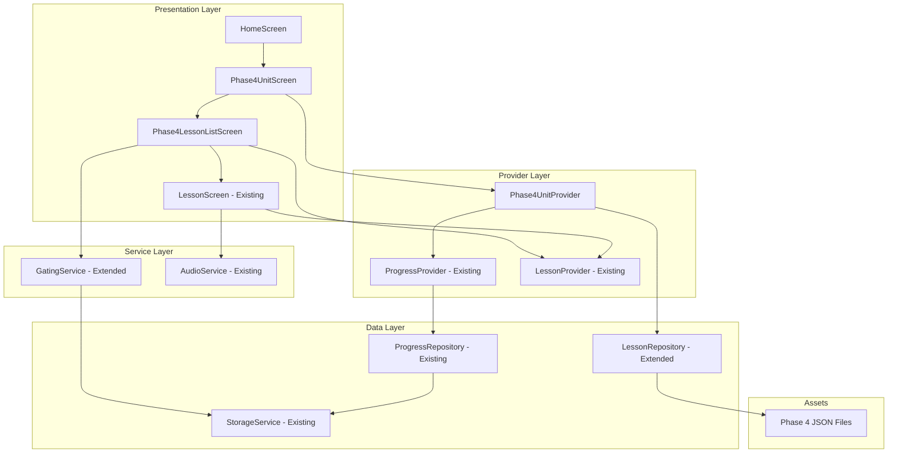

# Design Document: Phase 4 – Fluency, Pronunciation & Conversation

## Overview

Phase 4 is a B2-level fluency training module that extends the Engliya Flutter app with 4 units (Units 18-21) containing 17 lessons focused on pronunciation, fluency techniques, real-life conversations, and discussion skills. The implementation follows existing patterns from Phases 1-3, reusing the LessonScreen component while adding Phase 4-specific screens for unit and lesson navigation.

### Key Design Goals
- Maintain consistency with existing Phase 1-3 architecture
- Reuse LessonScreen for all lesson content display
- Support offline operation with mock scoring fallback
- Enable progressive lesson unlocking within and across units
- Integrate seamlessly with existing services (GatingService, LessonRepository, ProgressRepository)

## Architecture



## Components and Interfaces

### 1. Phase4UnitScreen

New screen displaying the 4 Phase 4 units with progress indicators.

```dart
class Phase4UnitScreen extends StatefulWidget {
  // Displays Unit 18-21 cards with mastery progress
  // Uses Phase4UnitProvider for state management
}

class Phase4UnitData {
  final String id;           // e.g., "phase4_unit18"
  final String title;        // e.g., "Pronunciation & Sound"
  final String description;
  final int totalLessons;
  final int masteredLessons;
  final bool isUnlocked;
}
```

### 2. Phase4LessonListScreen

New screen displaying lessons within a selected unit.

```dart
class Phase4LessonListScreen extends StatefulWidget {
  final String unitId;
  
  // Displays lesson cards with lock/progress status
  // Handles navigation to LessonScreen
}
```

### 3. Phase4UnitProvider

New provider managing Phase 4 unit state and progress.

```dart
class Phase4UnitProvider extends ChangeNotifier {
  List<Phase4UnitData> _units = [];
  bool _isLoading = false;
  String? _error;
  
  Future<void> loadUnits();
  Future<void> reload();
  int getMasteredCount(String unitId);
}
```

### 4. LessonRepository Extensions

Extend existing repository to handle Phase 4 lessons.

```dart
// Add to LessonRepository
Future<List<Lesson>> _loadPhase4UnitLessons(String unitId);
List<String> _getPhase4LessonIds(String unitId);
String _getPhase4AssetPath(String lessonId);
```

### 5. GatingService Extensions

Extend existing service to handle Phase 4 unlock logic.

```dart
// Add to GatingService
List<String> _getPhase4RequiredLessonIds();
// Update isPhaseUnlocked to handle phase 4
// Update isLessonUnlocked to handle phase4_ prefix
```

### 6. Route Definitions

```dart
// Add to AppRoutes
static const String phase4Unit = '/phase4';
static const String phase4LessonList = '/phase4/unit/:unitId';
// Reuse existing lesson route for Phase 4 lessons
```

## Data Models

### Lesson Model (Existing - No Changes)

The existing Lesson model supports all Phase 4 content:

```dart
class Lesson {
  final String id;
  final int order;
  final String unitId;
  final String title;
  final String description;
  final String level;
  final LessonExplain explain;
  final List<ExampleSentence> examples;
  final List<ListeningQuestion> listeningQuestions;
  final List<SpeakSentence> speakSentences;
  final List<QuizQuestion> practiceQuestions;
  final List<QuizQuestion> masteryQuestions;
}
```

### Dialogue Model (New - Optional Extension)

For conversation lessons in Units 20-21:

```dart
class Dialogue {
  final String roleA;
  final String roleB;
  final List<DialogueLine> lines;
}

class DialogueLine {
  final String speaker;
  final String text;
}
```

Note: The Dialogue model is optional. The existing LessonScreen can ignore the dialogues field if not implemented. The JSON will include dialogues for future use.

### Phase 4 JSON Schema

```json
{
  "id": "phase4_lesson18_1",
  "order": 1,
  "unitId": "phase4_unit18",
  "title": "Sounds & Syllables",
  "description": "Learn the basic sounds and syllables of English words.",
  "level": "B2",
  "explain": {
    "ta": "Tamil explanation...",
    "en": "English explanation...",
    "table": [...]
  },
  "examples": [...],
  "listeningQuestions": [...],
  "speakSentences": [...],
  "practiceQuestions": [...],
  "masteryQuestions": [...],
  "dialogues": [
    {
      "roleA": "Customer",
      "roleB": "Shopkeeper",
      "lines": [
        { "speaker": "Customer", "text": "..." },
        { "speaker": "Shopkeeper", "text": "..." }
      ]
    }
  ]
}
```

### Unit Structure

| Unit ID | Unit Name | Lessons |
|---------|-----------|---------|
| phase4_unit18 | Pronunciation & Sound | 4 lessons (18.1-18.4) |
| phase4_unit19 | Fluency Techniques | 4 lessons (19.1-19.4) |
| phase4_unit20 | Real-Life Conversations | 5 lessons (20.1-20.5) |
| phase4_unit21 | Discussion & Opinion Skills | 4 lessons (21.1-21.4) |

## Correctness Properties

*A property is a characteristic or behavior that should hold true across all valid executions of a system-essentially, a formal statement about what the system should do. Properties serve as the bridge between human-readable specifications and machine-verifiable correctness guarantees.*

### Property 1: Phase 4 Unlock Consistency
*For any* storage state where phase3FinalTestPassed is true, checking Phase 4 unlock status through GatingService SHALL return true.
**Validates: Requirements 1.1**

### Property 2: Debug Mode Phase Bypass
*For any* storage state and any phase3FinalTestPassed value, when debug mode is enabled, checking Phase 4 unlock status SHALL return true.
**Validates: Requirements 1.3**

### Property 3: Unit Navigation Consistency
*For any* unit tap action on Phase4UnitScreen, the system SHALL navigate to Phase4LessonListScreen with the correct unitId parameter.
**Validates: Requirements 2.2**

### Property 4: Progress Count Accuracy
*For any* unit with N total lessons and M mastered lessons (where M <= N), the displayed progress SHALL show "M/N lessons mastered".
**Validates: Requirements 2.3**

### Property 5: Lesson Navigation Consistency
*For any* unlocked lesson tap action, the system SHALL open LessonScreen with the correct lessonId.
**Validates: Requirements 2.4**

### Property 6: Sequential Lesson Unlocking
*For any* lesson L at position P in a unit, when lesson at position P-1 is mastered, lesson L SHALL become unlocked.
**Validates: Requirements 3.2**

### Property 7: Cross-Unit Unlocking
*For any* unit U with all lessons mastered, the first lesson of unit U+1 SHALL become unlocked (if U+1 exists).
**Validates: Requirements 3.3**

### Property 8: Debug Mode Lesson Bypass
*For any* Phase 4 lesson and any mastery state, when debug mode is enabled, the lesson SHALL be unlocked.
**Validates: Requirements 3.4**

### Property 9: Dialogue Structure Validity
*For any* lesson JSON containing a dialogues field, each dialogue SHALL have non-empty roleA, roleB, and at least one line.
**Validates: Requirements 6.2, 6.4**

### Property 10: Speaking Service Selection
*For any* speaking exercise, the system SHALL use STT when available and fall back to mock scoring when STT is unavailable.
**Validates: Requirements 8.1, 8.2**

### Property 11: Speaking Feedback Presence
*For any* completed speaking exercise, the system SHALL display an encouragement message from the predefined set.
**Validates: Requirements 8.3**

### Property 12: JSON Parsing Round Trip
*For any* valid Phase 4 lesson JSON, parsing to Lesson object and serializing back SHALL produce equivalent JSON structure.
**Validates: Requirements 9.2**

### Property 13: Progress Storage Consistency
*For any* Phase 4 lesson progress update, the UserLessonStatus map SHALL contain the updated status for that lesson ID.
**Validates: Requirements 10.1**

### Property 14: GatingService Integration
*For any* Phase 4 unlock check, the result SHALL match the GatingService.isPhaseUnlocked(4) return value.
**Validates: Requirements 10.2**

### Property 15: Repository Pattern Handling
*For any* unitId matching pattern "phase4_unit*", LessonRepository.loadUnitLessons SHALL return the correct lessons for that unit.
**Validates: Requirements 10.4**

## Error Handling

### Asset Loading Errors
- If a Phase 4 JSON file fails to load, log the error and continue loading other lessons
- Display error state in UI with retry option
- First lesson of first unit is critical - rethrow if it fails

### STT Service Errors
- Catch STT initialization failures gracefully
- Fall back to mock scoring with user notification
- Log STT errors for debugging

### Navigation Errors
- Validate route arguments before navigation
- Display error screen for missing/invalid arguments
- Provide back navigation from error states

### Progress Persistence Errors
- Retry progress save on failure
- Cache progress locally if remote save fails
- Sync on next app launch

## Testing Strategy

### Property-Based Testing Library
Use `fast_check` package for Dart property-based testing.

### Unit Tests
- Test Phase4UnitProvider state management
- Test GatingService Phase 4 unlock logic
- Test LessonRepository Phase 4 lesson loading
- Test JSON parsing for all 17 lesson files

### Property-Based Tests
Each correctness property will be implemented as a property-based test:

1. **Property 1 Test**: Generate random storage states with phase3FinalTestPassed=true, verify Phase 4 unlocks
2. **Property 2 Test**: Generate random storage states with debug mode enabled, verify Phase 4 unlocks
3. **Property 4 Test**: Generate random mastery states for units, verify progress count matches
4. **Property 6 Test**: Generate random lesson sequences, verify sequential unlocking
5. **Property 7 Test**: Generate random unit completion states, verify cross-unit unlocking
6. **Property 9 Test**: Generate random dialogue structures, verify validity constraints
7. **Property 12 Test**: Generate random lesson JSON, verify round-trip parsing

### Integration Tests
- Test full navigation flow from HomeScreen to LessonScreen
- Test progress persistence across app restarts
- Test debug mode toggle effects on all Phase 4 content

### Test Annotations
All property-based tests will be annotated with:
```dart
// **Feature: phase4-fluency-pronunciation, Property {number}: {property_text}**
// **Validates: Requirements X.Y**
```
