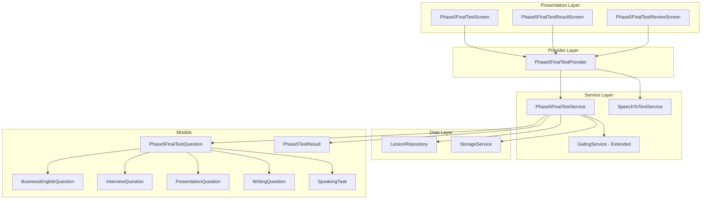

# Design Document: Phase 5 Final Test

## Overview

The Phase 5 Final Test is the ultimate certification assessment that evaluates learners' professional English mastery. It serves as the final gateway in the English Communication Mastery Program. The test consists of 35 tasks across 5 sections with a maximum score of 60 points, requiring 75% (45 points) to pass and achieve English Mastery Certification.

### Key Design Goals
- Follow existing Phase 1-4 Final Test patterns for consistency
- Support 5 question types: Business English, Interview, Presentation, Writing MCQs, and Professional Speaking Tasks
- Implement enhanced STT-based speaking scoring (0-4 points) with mock fallback
- Enable mistake review for MCQ questions only
- Set `englishMasteryCompleted` flag upon passing
- Integrate with existing GatingService and StorageService

## Architecture



## Components and Interfaces

### 1. Phase5FinalTestQuestion (Union Type)

Base class representing any question type in the Phase 5 Final Test.

```dart
enum Phase5QuestionType {
  businessEnglish,
  interview,
  presentation,
  writing,
  speaking,
}

class Phase5FinalTestQuestion {
  final String id;
  final Phase5QuestionType type;
  final String unitId;
  final String lessonId;
  final String prompt;
  final List<String>? options;      // null for speaking tasks
  final int? correctIndex;          // null for speaking tasks
  
  // Factory constructors for each type
  factory Phase5FinalTestQuestion.businessEnglish(...);
  factory Phase5FinalTestQuestion.interview(...);
  factory Phase5FinalTestQuestion.presentation(...);
  factory Phase5FinalTestQuestion.writing(...);
  factory Phase5FinalTestQuestion.speaking(...);
  
  bool get isMcq => type != Phase5QuestionType.speaking;
}
```

### 2. Phase5SpeakingTask

```dart
class Phase5SpeakingTask {
  final String prompt;  // Professional speaking prompt
}
```

### 3. Phase5TestResult

```dart
class Phase5TestResult {
  final int totalQuestions;           // Always 35
  final int maxScore;                 // Always 60
  final int mcqCorrect;               // Out of 27 (8+7+6+6)
  final int speakingScore;            // Out of 32 (8 tasks × 4 points)
  final int totalScore;               // mcqCorrect + speakingScore
  final double percentage;
  final bool passed;                  // totalScore >= 45
  final DateTime completedAt;
  final List<Phase5IncorrectAnswer> incorrectMcqAnswers;
  final List<Phase5SpeakingResult> speakingResults;
  
  factory Phase5TestResult.calculate(...);
}
```

### 4. Phase5SpeakingResult

```dart
class Phase5SpeakingResult {
  final String taskId;
  final String prompt;
  final String? recognizedText;
  final int wordCount;
  final int score;            // 0-4
  final String feedback;
}
```

### 5. Phase5IncorrectAnswer

```dart
class Phase5IncorrectAnswer {
  final Phase5FinalTestQuestion question;
  final int selectedIndex;
  final String selectedAnswer;
  final String correctAnswer;
}
```

### 6. Phase5FinalTestService

```dart
class Phase5FinalTestService {
  // Storage keys
  static const String keyTestPassed = 'phase5_final_test_passed';
  static const String keyTestScore = 'phase5_final_test_score';
  static const String keyTestDate = 'phase5_final_test_date';
  static const String keyMasteryCompleted = 'english_mastery_completed';
  
  // Question distribution
  static const int businessEnglishCount = 8;
  static const int interviewCount = 7;
  static const int presentationCount = 6;
  static const int writingCount = 6;
  static const int speakingCount = 8;
  static const int totalQuestions = 35;
  static const int passingScore = 45;
  static const int maxScore = 60;
  
  Future<List<Phase5FinalTestQuestion>> generateTest();
  Future<bool> canTakeTest();
  bool validateMcqAnswer(Phase5FinalTestQuestion question, int selectedIndex);
  Phase5SpeakingScoreResult scoreSpeakingTask(String? recognizedText);
  Phase5TestResult calculateResult(...);
  Future<void> saveTestResult(Phase5TestResult result);
  Future<bool> hasPassedTest();
  Future<bool> isEnglishMasteryCompleted();
}
```

### 7. Phase5FinalTestProvider

```dart
class Phase5FinalTestProvider extends ChangeNotifier {
  List<Phase5FinalTestQuestion> _questions = [];
  List<dynamic> _answers = [];  // int? for MCQ, Phase5SpeakingResult for speaking
  int _currentQuestionIndex = 0;
  bool _isLoading = false;
  String? _error;
  Phase5TestResult? _testResult;
  
  // Getters
  Phase5FinalTestQuestion? get currentQuestion;
  double get progress;
  bool get canProceed;
  bool get isLastQuestion;
  
  // Actions
  Future<void> startTest();
  void selectMcqAnswer(int index);
  void recordSpeakingResult(Phase5SpeakingResult result);
  void nextQuestion();
  void skipQuestion();
  Future<void> submitTest();
}
```

## Data Models

### Test Composition

| Section | Type | Count | Points Each | Max Points |
|---------|------|-------|-------------|------------|
| A | Business English MCQ | 8 | 1 | 8 |
| B | Interview Response MCQ | 7 | 1 | 7 |
| C | Presentation Language MCQ | 6 | 1 | 6 |
| D | Writing Logic MCQ | 6 | 1 | 6 |
| E | Professional Speaking Task | 8 | 0-4 | 32 |
| **Total** | | **35** | | **60** |

### Speaking Scoring Tiers (Enhanced for Professional Level)

| Criteria | Score | Feedback |
|----------|-------|----------|
| 40-80 words, clear structure, confident | 4 | "Excellent! Clear, confident, and well-structured response." |
| 25-39 words, good but slightly short | 3 | "Good response! Try to expand with more details." |
| 10-24 words, basic, lacks structure | 2 | "Basic response. Work on structure and confidence." |
| 1-9 words, very weak | 1 | "Very brief. Practice speaking in complete sentences." |
| 0 words, no response | 0 | "No speech detected. Please try again." |

### Unit-to-Question Mapping

| Unit | Lesson IDs | Question Types |
|------|------------|----------------|
| Unit 22 | phase5_lesson22_1 - 22_4 | Business English MCQs |
| Unit 23 | phase5_lesson23_1 - 23_4 | Interview Response MCQs |
| Unit 24 | phase5_lesson24_1 - 24_4 | Presentation Language MCQs |
| Unit 25 | phase5_lesson25_1 - 25_4 | Writing Logic MCQs, Speaking Tasks |

## Correctness Properties

*A property is a characteristic or behavior that should hold true across all valid executions of a system-essentially, a formal statement about what the system should do. Properties serve as the bridge between human-readable specifications and machine-verifiable correctness guarantees.*

### Property 1: Test Access Gating
*For any* mastery state where all Phase 5 lessons (Units 22-25) are mastered, the canTakeTest() method SHALL return true. Conversely, for any incomplete mastery state, canTakeTest() SHALL return false (unless debug mode is enabled).
**Validates: Requirements 1.1, 1.2**

### Property 2: Debug Mode Bypass
*For any* mastery state and any debug mode setting, when debug mode is enabled, canTakeTest() SHALL return true regardless of lesson mastery status.
**Validates: Requirements 1.3**

### Property 3: Question Distribution Consistency
*For any* generated test, the question distribution SHALL be exactly: 8 business English MCQs, 7 interview MCQs, 6 presentation MCQs, 6 writing MCQs, and 8 speaking tasks, totaling 35 questions.
**Validates: Requirements 1.4, 2.1, 3.1, 4.1, 5.1, 6.1, 11.2**

### Property 4: MCQ Scoring Consistency
*For any* MCQ question (business, interview, presentation, or writing) and any selected answer index, the score SHALL be 1 if selectedIndex equals correctIndex, and 0 otherwise.
**Validates: Requirements 2.3, 3.3, 4.3, 5.3**

### Property 5: Speaking Score Tiers
*For any* speaking task result with word count W, the score SHALL be: 4 if 40 <= W <= 80, 3 if 25 <= W < 40, 2 if 10 <= W < 25, 1 if 1 <= W < 10, 0 if W == 0.
**Validates: Requirements 6.5**

### Property 6: Pass/Fail Threshold
*For any* test result with total score S, the passed flag SHALL be true if and only if S >= 45.
**Validates: Requirements 7.2, 7.3**

### Property 7: Result Persistence Consistency
*For any* passing test result, after saveTestResult() is called, the storage SHALL contain phase5FinalTestPassed=true, englishMasteryCompleted=true, the correct phase5FinalTestScore value, and phase5FinalTestDate.
**Validates: Requirements 9.1, 9.2, 9.3, 9.4**

### Property 8: Review Filtering
*For any* test result, the incorrectMcqAnswers list SHALL contain only MCQ questions where the selected answer was incorrect, and SHALL exclude all speaking tasks.
**Validates: Requirements 8.1, 8.3**

### Property 9: Question Model Validity
*For any* generated question, MCQ types (business, interview, presentation, writing) SHALL have non-null options and correctIndex, while speaking tasks SHALL have null options and correctIndex.
**Validates: Requirements 10.1, 10.2, 10.3, 10.4, 10.5**

### Property 10: Total Score Calculation
*For any* set of answers, the total score SHALL equal the sum of MCQ correct answers (0 or 1 each) plus speaking scores (0-4 each), with maximum possible score of 60.
**Validates: Requirements 7.1**

### Property 11: Fallback Question Guarantee
*For any* lesson content state (including empty), generateTest() SHALL return exactly 35 questions by using fallback hardcoded questions when lesson content is insufficient.
**Validates: Requirements 11.3**

## Error Handling

### Test Generation Errors
- If lesson JSON files fail to load, use fallback hardcoded questions
- Log errors but continue test generation
- Ensure minimum 35 questions are always available

### STT Service Errors
- Catch STT initialization failures gracefully
- Fall back to mock scoring with randomized variance (±1)
- Display user-friendly message about fallback mode

### Storage Errors
- Retry storage operations on failure
- Show warning snackbar if results cannot be saved
- Allow user to retry saving results

### Navigation Errors
- Validate route arguments before navigation
- Display error screen for missing/invalid arguments
- Provide back navigation from error states

## Testing Strategy

### Property-Based Testing Library
Use `fast_check` package for Dart property-based testing.

### Unit Tests
- Test Phase5FinalTestService question generation
- Test scoring logic for all question types
- Test result calculation and persistence
- Test GatingService Phase 5 test unlock logic

### Property-Based Tests
Each correctness property will be implemented as a property-based test:

1. **Property 1 Test**: Generate random mastery states, verify canTakeTest() returns correct value
2. **Property 2 Test**: Generate random mastery states with debug mode enabled, verify canTakeTest() always returns true
3. **Property 3 Test**: Generate multiple tests, verify question distribution is always correct
4. **Property 4 Test**: Generate random MCQ answers, verify scoring is consistent
5. **Property 5 Test**: Generate random word counts, verify speaking scores match tiers
6. **Property 6 Test**: Generate random total scores, verify pass/fail threshold
7. **Property 7 Test**: Generate passing results, verify storage contains correct values
8. **Property 8 Test**: Generate random test results, verify review filtering excludes speaking tasks
9. **Property 9 Test**: Generate questions, verify MCQ types have options/correctIndex, speaking has null
10. **Property 10 Test**: Generate random answers, verify total score calculation
11. **Property 11 Test**: Generate tests with empty lesson content, verify 35 questions returned

### Integration Tests
- Test full test flow from start to result screen
- Test speaking task recording and scoring
- Test mistake review navigation
- Test English Mastery completion after passing

### Test Annotations
All property-based tests will be annotated with:
```dart
// **Feature: phase5-final-test, Property {number}: {property_text}**
// **Validates: Requirements X.Y**
```
